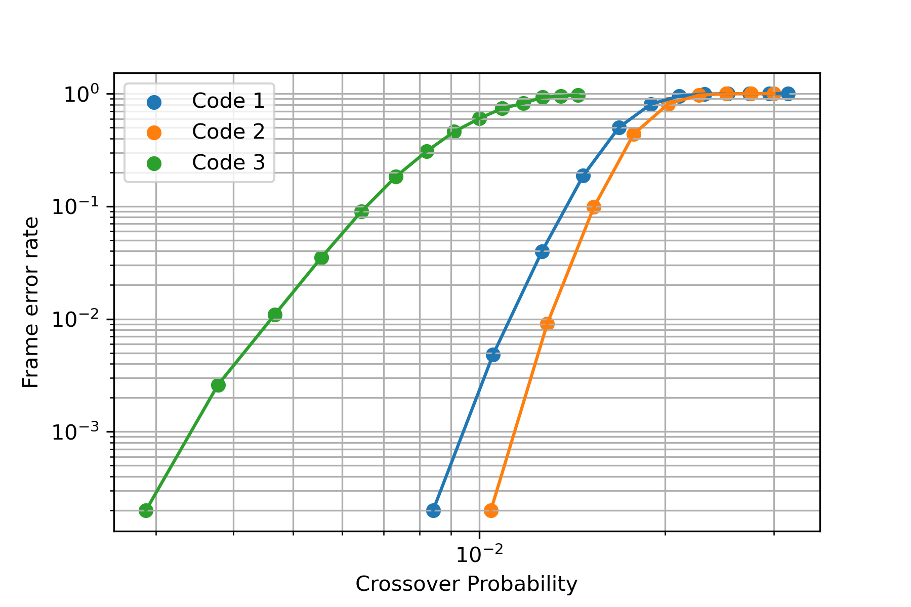

# asymmetric_slepian_wolf

This is a simple code to simulate an asymmetric Slepian-Wolf setting, where the compression/encoding is
done with an LDPC code and the decoding uses side information at the receiver.
For details on the theory, please see the report (pdf file).

The workflow for simulation is as follows.

0. The program expects a parity check matrix 
   in sparse column format, given as two .npy files:
   
   - One file containing the column pointers
   - One file containing the row-indeces
   
   You can either provide those yourself, or use some of the
   codes provided by MacKay in his online archive
   (https://www.inference.org.uk/mackay/codes/data.html).
   
   There you can look for some of the matrices of interest in the alist
   format. Use the instructions on the `convert_alist_to_csc.ipynb` notebook
   to convert it into the required files.
   
1. Run with the preset example of a code of blocksize 1908 or
   Adjust the parameters in the "sw_test.cpp" file. 
   
   - n_rows (number of rows of the parity check matrix)
   - n_cols (number of columns of the parity check matrix)
   - sweep_min (start of the BSC crossover parameter sweep)
   - sweep_max (end of the BSC crossover parameter sweep)
   - steps (number of points to sweep)
   
  
2. Go into the root directory `information theory` adn built the project

   ```
   g++ sw_test.cpp simulation_utils.cpp encoding_decoding.cpp -o simulation
   ```
   
3. Run the simulation by executing the file
   ```
   ./simulation
   ```
   
   Once the simulation is done, two files will be saved in the results directory,
   one containing the given crossover probability, and the other one containg the 
   measured Frame error rate.
   
   The simulation is heavily inspired by the following repository:
   https://github.com/XQP-Munich/LDPC4QKD
   Credit is also due to the following repository, handling the numpy array integration into C++
   https://github.com/llohse/libnpy
   
4. Plot the results using the notebook `plot_cpp_data.ipynb`.
   
   
   
   Please keep in mind that this is a simple coursework project, with the corresponding sophistication.
